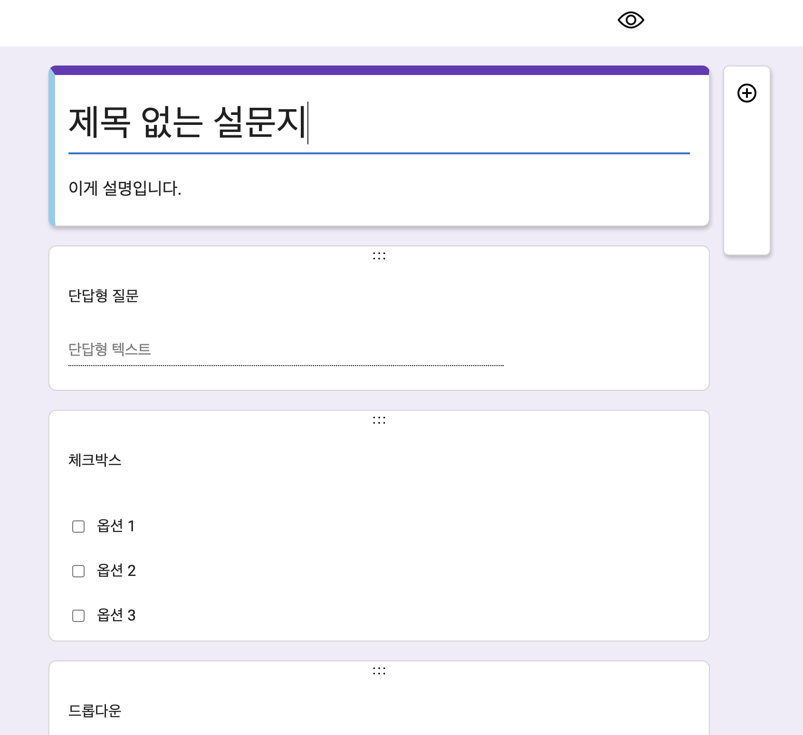
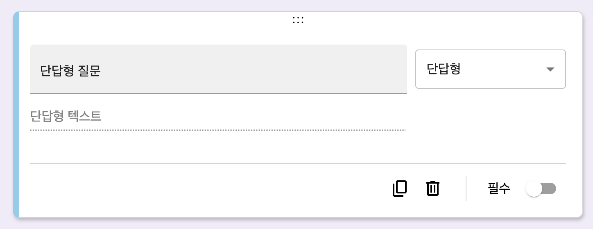
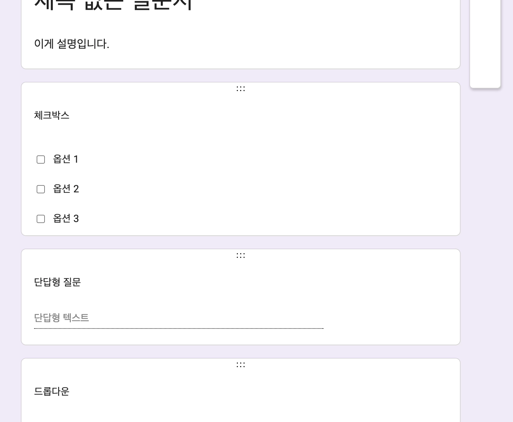
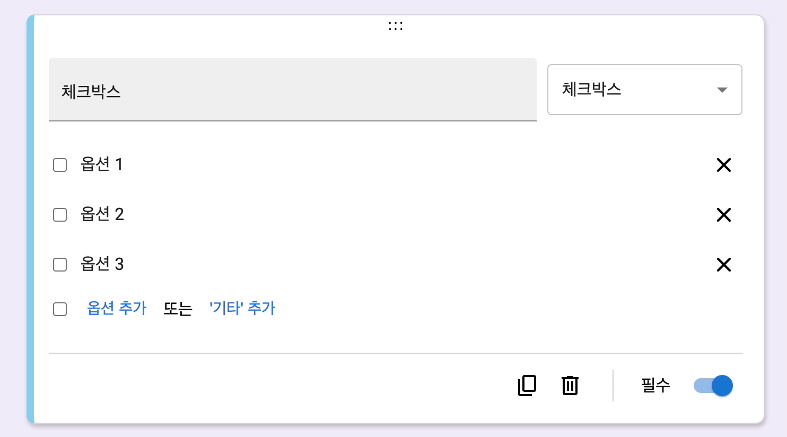
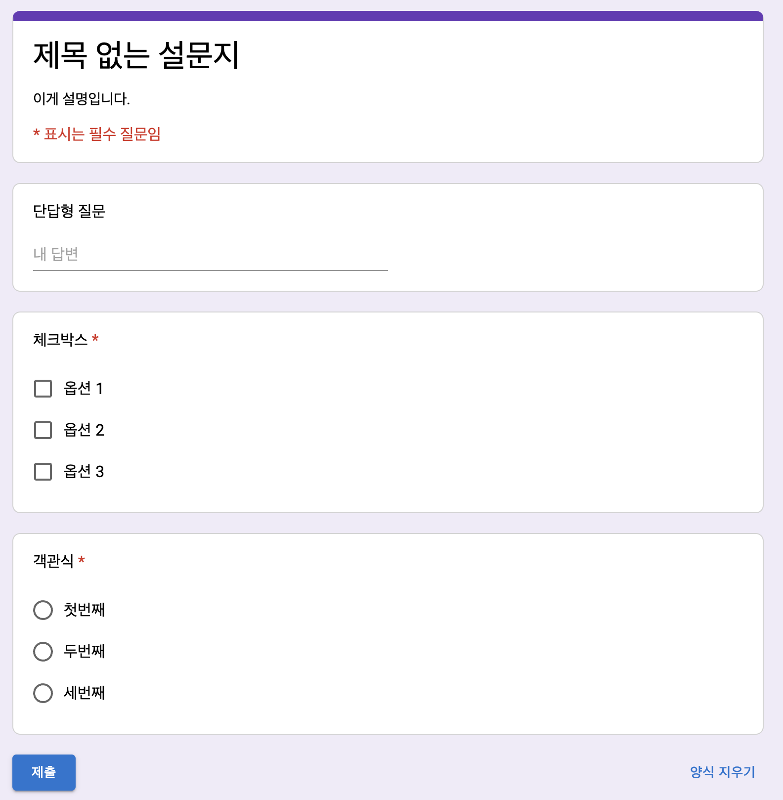
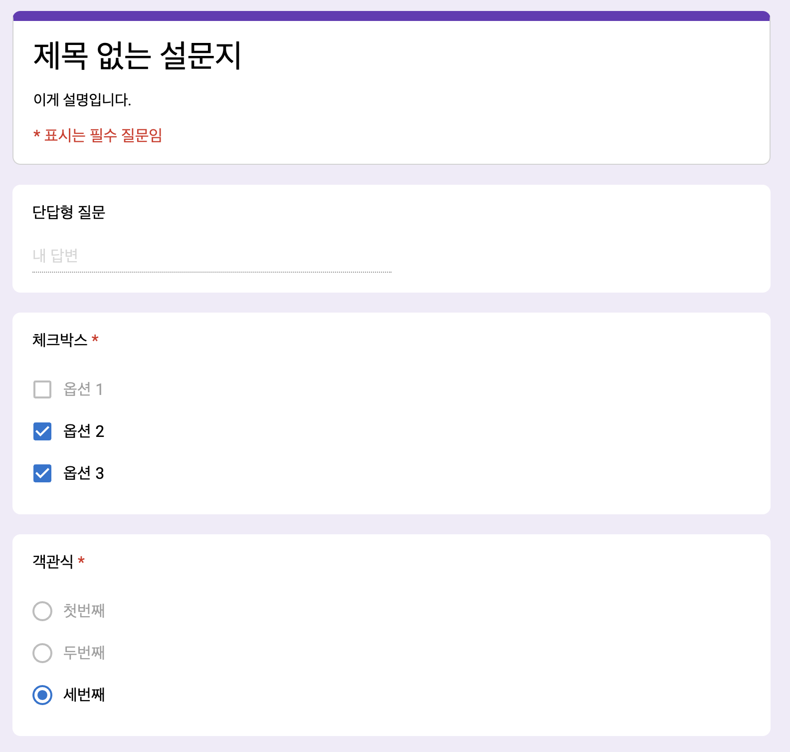

# ts-google-forms

typescript + React + Redux로 구현한 구글 폼입니다.

## Play Demo

https://ts-google-forms.vercel.app/

## 기술스택

- Vite
- React + TypeScript
- Redux + Redux Toolkit
- Redux-persist
- MUI
- Styled-components
- React-hook-form
- React-beautiful-dnd

## Getting Started

`npm install`

`npm run dev`

open http://localhost:5173/

## 주요 기능

- 설문지 제목, 설명 수정
- 질문 문항 포커스, 추가, 복사, 삭제
- 문항 타입 (단답형/장문형/객관식/체크박스/드롭다운) 변경
- 필수 문항 설정

  

- 문항 순서 드래그 앤 드롭

  

- 옵션 추가, 삭제
- 옵션 순서 드래그 앤 드롭

  

- 설문지 미리보기

  

- 설문지 응답 확인

  

- 설문지 응답 초기화
- 설문지 데이터 브라우저 저장
